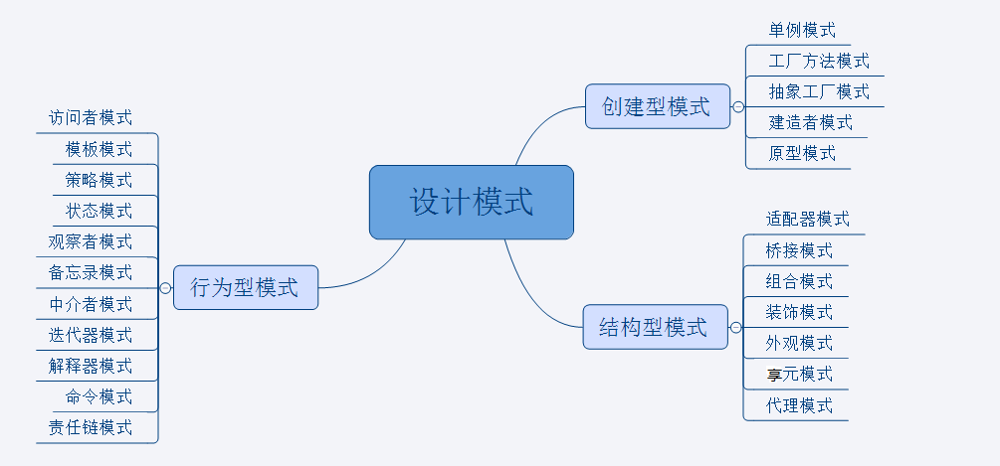

### 创建型模式：5种

#### 工厂方法模式

定义一个接口A，接口方法为具体需要做的事情动作；
完成具体功能的类需要实现这个接口;
定义一个工厂类，类里写一个produce方法，用于分类生产需要的A的实现类，用于不同的操作；
优化：将类型区分修改为多个工厂提供方法；静态工厂方法
不足：新加实现类，需要改变工厂类的方法

#### 抽象工厂模式

1.将工厂类也抽象为接口，具体的每个动作类提供一个工厂方法的实例
2.优点：此方法在新增工厂方法时不改变原来的代码，易于扩展；
3.不足：不够简单，类变多了

#### 单例模式

1.保证只有一个实例对象

4、建造者模式
1.类似于工厂方法，只是工厂方法创建一个类，而建造者模式创建一个满足要求的对象，对象可能比较复杂是多个对象的集合；

#### 原型模式（prototype）

1.以对象为原型，对其进行复制、克隆产生一个类似的新对象；
2.简单的可以实现Cloneable 接口；
3.如果需要深复制，需要采用流的形式读取二进制，再写入到对应的新对象；

### 结构性模式：7种

#### 适配器模式

1.将某个类的接口转换成客户期望的另一个接口，消除接口不匹配造成的兼容性问题；
2.对象的适配器模式：类持有摸个对象实例，完成适配器的功能；
3.接口适配器模式：一个抽象类实现了所有的接口，适配器类继承抽象对象，重写我们需要的接口即可；

#### 装饰设计模式

1.为一个类动态的扩展功能；
2.装饰类与被装饰类需要实现同一个接口；
3.装饰类持有被装饰类的实例对象；
4.优点：动态的扩展功能，继承不能动态的添加和撤销，还会产生过多的相似对象；

#### 代理模式（Proxy）

1.代理类和被代理带向实现同一个接口；
2.代理类控制被代理对象的访问，对结果处理；
3.代理对象与被代理的都系昂关系编译时已经确定，客户端不知道被代理对象的存在；
4.与装饰设计模式的区别：装设设计模式关注对象功能的扩展，被装饰的对象作为参数传给装饰者，客户端知道被装饰对象的存在；

#### 外观模式（门面模式）（Facade）

1.外观模式解决了类与类之间的依赖关系，降低类之间的耦合度；

#### 桥接模式（Bridge）

1.桥接模式把事务和其具体的实现分开，以便他们可以各自独立的变化；
2.定义一个接口A，接口可以有多个实现类；
3.定义一个抽象类，抽象类持有A的实现，提供获取、设置A实现类的方法；
4.具体的桥接类，实现抽象类，并初始化接口A的实例类设置给桥接类中调用该实例的方法；

#### 组合模式（部分-整体模式）（Composite）

1.处理类似树形结构的问题时比较方便；

#### 享元模式（Flyweight）

1.享元模式主要目的是实现对象的共享，即共享池，比如数据库连接池；
2.通常与工厂模式一起使用；

### 行为型模式：11种

#### 策略模式（strategy）

1.策略模式定义一系列的算法，并将每个算法封装起来，算法可以相互替换；
2.如：计算器类的设计，加、减、乘、除等算法；
3.设计一个接口，为实现类提供统一的方法，多个实现类实现该接口提供不同的算法；
4.设计一个抽象的辅助类（可有可无）；

#### 模板方法模式（Template Method）

1.定义一个抽象类，抽象类中再定义1~n个方法，可以是抽象的也可以是实际的方法；
2.定义一个类继承该抽象类，重写抽象方法，通过调用抽象类实现对子类的调用；
3.如：策略模式中的抽象辅助类；

#### 观察者模式（Observer）

1.定义主对象、观察者接口；
2.抽象类实现主对象接口，定义添加、删除观察者方法，维护一个观察者列表，定义一个通知所有观察者的方法；
3.写一个主对象继承抽象的观察者，完成具体的操作方法；
4.多个观察者类都需要实现观察者接口，观察者接口有被主独享调用的update()方法用于通知更新；
5.观察者依赖于主对象被动更新；

#### 迭代子模式（Iterator）

1.迭代器模式就是顺序的访问聚集中的对象，比如JDK中的集合；
2.迭代器模式中需要两个对象：（1）需要遍历的对象，（2）迭代器对象；

#### 责任链模式（Chain of Responsibility）

1.责任链模式有多个对象，每个对象持有下一个对象的引用，形成一条链,请求在这条链上传递，直到某一个对象决定处理该请求；
2.责任链模式可以在隐瞒客户端的情况下，对系统进行动态的调整；
3.如：JAVA WEB中的过滤器链，springmvc中的拦截器链，Struts2中的拦截器栈等；

#### 命令模式（Command）

1.命令、调用者、执行者三者互相不依赖，独立发展；
2.调用者发出命令传递给执行者，实现一个完整的过程；

#### 备忘录模式（Memento）

1.主要目的是保存一个对象的某个状态，以便在适当的时候恢复对象，对对象的属性做备份；

#### 状态模式（State）

1.核心思想：当对象的状态改变时，同时改变其行为；

#### 访问者模式（Visitor）

1.分离对象的数据结构与行为的方法，通过这种分离可达到为被访问者动态添加新的操作而无需做其它修改的效果；
2.优点：数据结构与行为（操作）分离，添加新的操作方便；
3.局限：适用于数据结构相对稳定的系统，添加新的数据结构很困难；

#### 中介者模式（Mediator）

1.降低类之间的耦合度；
2.中介者类持有两个类的实例，有中介者类维护类之间的关系；

#### 解释器模式（Interpreter）

1. 应用于oop开发中的编译器开发中；
2. 解释器模式用来做各种样的解释器，如正则表达式等的解释器；
